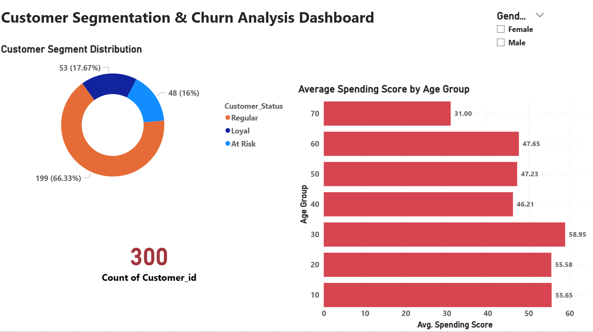

# Customer Segmentation Churn Risk Analysis

## 📊 Project Overview
Analyzed 300 customer records to identify high-value demographics and churn risks. This project demonstrates end-to-end data analysis skills—moving from raw data cleaning in **Excel** to validation in **SQL** and finally to an interactive dashboard in **Power BI**.

## 🎯 Business Problem
The business needs to understand:
* Which age groups drive the highest engagement and spending.
* The distribution of "At Risk" vs. "Loyal" customers.
* How gender influences customer status and spending behavior.
* Actionable insights to improve retention for high-value segments.

## 🛠️ Tools & Technologies
* **Microsoft Excel:** Data cleaning, grouping (binning), and Pivot Table analysis.
* **SQL:** Data validation, categorical analysis, and KPI calculation.
* **Power BI:** Interactive dashboard design, and demographic segmentation.

## 📁 Dataset Information
* **Records:** 300 unique customer rows.
* **Key Fields:** Customer ID, Age, Gender, Annual Income, Spending Score (0-100), and Customer Status.
* **Source:** Cleaned Customer Churn Dataset.

## 🔍 Key Findings

### Revenue & Spending Metrics
* **Total Customers:** 300
* **Average Spending Score:** 51.38
* **Top Performing Segment:** The **30-39 Age Group** is the most profitable, with a peak average spending score of **58.95**.

### Demographic Performance (Average Spending Score)
* **20-29:** 55.58
* **30-39:** 58.95 (Highest)
* **40-49:** 46.21
* **60-70:** 47.09

### Churn & Loyalty Analysis
* **At Risk:** 48 customers (16%)
* **Loyal:** 53 customers (17.7%)
* **Regular:** 199 customers (66.3%)
* **Critical Insight:** Female customers represent a higher portion of the "At Risk" segment (28 females vs 20 males).

## 💡 Business Recommendations
1. **Targeted Marketing:** Focus loyalty rewards on the **30-39 age bracket**, as they are the highest spenders.
2. **Retention Campaign:** Launch a re-engagement campaign specifically for **Female "At Risk" customers** to reduce churn.
3. **Product Investigation:** The 40-49 age group has the lowest score (46.21); investigate if current products align with their needs.

## 📂 Project Files
| File Name | Description |
| :--- | :--- |
| **Cleaned_Customer_Churn_Data.csv** | The final, validated dataset. |
| **Customer_Analysis_SQL_Queries.sql** | SQL scripts for data validation. |
| **Customer_Segmentation_Pivot_Report.xlsx** | Excel workbook with grouped pivot tables. |
| **Customer_Churn_&_Spending_Analysis_PowerBi.pbix** | Interactive Power BI dashboard. |
| **PowerBI_DashBoard.png** | Dashboard screenshot for quick preview. |

## 🚀 How to Use This Project
1. **SQL:** Import the CSV and run the `.sql` file to see KPI calculations.
2. **Power BI:** Open the `.pbix` file to interact with the dashboard filters.
3. **Excel:** View the Pivot Table sheets to see the Age Grouping logic.

## 📊 Dashboard Preview

## 👤 About This Project
This project was created to demonstrate my transition from customer operations to Data Analytics. It showcases my ability to process messy data and generate actionable business insights.

## 📧 Contact
**Siddu Kumar Atti**
* **LinkedIn:** [linkedin.com/in/siddu-kumar-045a24244](https://linkedin.com/in/siddu-kumar-045a24244)
* **Email:** siddukumar1292@gmail.com
* **GitHub:** [github.com/SidduKumar-1292](https://github.com/SidduKumar-1292)
